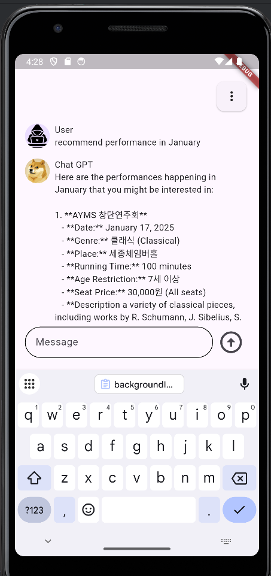

# **Suddy GPT**
공연을 추천해주는 **Suddy GPT**입니다.

---

## **소개**
**Suddy GPT**는 세종문화회관에서 진행하는 공연(클래식, 뮤지컬, 연주회 등)의 정보를 기반으로 사용자의 취향과 일정을 고려하여 적절한 공연을 추천해주는 Flutter 애플리케이션입니다.

원하는 공연과 일자가 있다면 **Suddy**에게 물어보세요. OpenAI의 GPT API를 이용해 최적의 답변을 제공해 드립니다.

---

## **주요 기능**
- **공연 정보 추천**
    - 세종문화회관의 클래식, 뮤지컬, 연주회 등 다양한 공연 정보를 제공합니다.
    - 원하는 공연 유형과 날짜를 입력하면 가장 적절한 공연을 추천해줍니다.

- **텍스트 유사도 기반 추천**
    - OpenAI GPT API를 활용하여 입력된 텍스트와 가장 유사한 공연 정보를 검색합니다.
    - **RAG**(Retrieval-Augmented Generation) 방식을 차용해, 정확하고 적절한 답변을 생성합니다.

---

## **기술 스택**
- **Framework**: Flutter
- **API**: OpenAI GPT API
- **AI 방식**: RAG (Retrieval-Augmented Generation)

---

## **스크린샷**




> 위 이미지는 **`assets/images/screenshot.png`**에 저장된 예시 화면입니다.  
> 실제 파일명과 경로를 맞게 설정해주세요.

---

## **설치 및 실행 방법**

### **1. 프로젝트 클론**
터미널에서 다음 명령어를 실행합니다:
```bash
git clone <프로젝트 레포지토리 링크>
cd <프로젝트 폴더>
